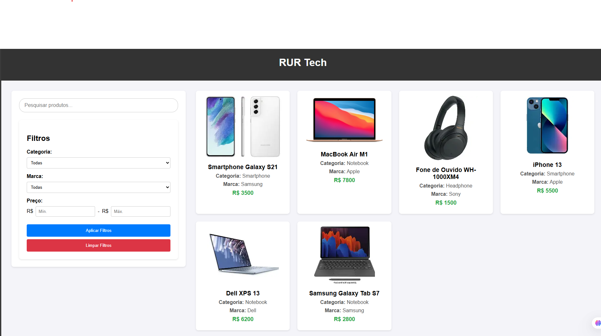

  

# RUR Tech 

Projeto feito com o objetivo de criar um sistema de busca e filtros funcional e simples para um e-commerce.

  <a href="#-tecnologias">Tecnologias</a>&nbsp;&nbsp;&nbsp;|&nbsp;&nbsp;&nbsp;
  <a href="#-projeto">Projeto</a>&nbsp;&nbsp;&nbsp;|&nbsp;&nbsp;&nbsp;
  <a href="#-contato">Contato</a>&nbsp;&nbsp;&nbsp;

  

 

## 🚀 Tecnologias

Esse projeto foi desenvolvido com as seguintes tecnologias:

- HTML e CSS
- JavaScript 
- Git e GitHub
- React
- NodeJS
- Vite

## 💻 Projeto

Sistema de busca e filtros para uma loja virtual.

[🔗 Clique aqui para acessar]()

# 📱 Contato
rafaeluzan@live.com
